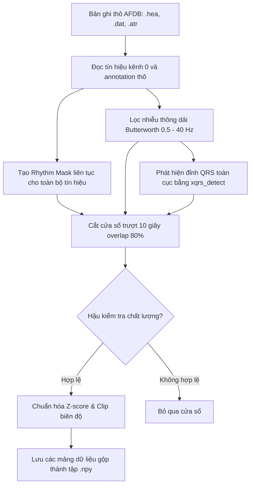

# Hướng dẫn Tiền xử lý Dữ liệu ECG (MIT-BIH AFDB)

Tài liệu này giải thích chi tiết về nguyên lý hoạt động, thuật toán xử lý tín hiệu và luồng dữ liệu của các file trong thư mục tiền xử lý: [pipeline.ipynb](file:///home/pd/data/info_model/build_model/preprocessing/pipeline.ipynb), [run_test.py](file:///home/pd/data/info_model/build_model/preprocessing/run_test.py), và [run_batch.py](file:///home/pd/data/info_model/build_model/preprocessing/run_batch.py).

---

## 1. Luồng hoạt động tổng quan (Overall Workflow)

---

## 2. Nguyên lý hoạt động chi tiết của từng thuật toán

### Bước 2.1: Đọc tín hiệu và trích xuất kênh
* **Tại sao chỉ lấy kênh 0?** Mỗi bản ghi trong MIT-BIH AFDB có 2 kênh ECG (`ECG1` và `ECG2`). Để đưa vào mô hình phát hiện rung nhĩ 1 kênh (1-channel ECG), chúng ta sử dụng `wfdb.rdrecord` với tham số `channels=[0]` để chỉ trích xuất duy nhất kênh đầu tiên.
* **Tần số lấy mẫu:** Dữ liệu gốc đã được lấy mẫu ở tần số **250 Hz**, khớp với cấu hình mô hình, nên không cần bước giảm tần số lấy mẫu (downsampling).

### Bước 2.2: Thuật toán gán nhãn liên tục (Rhythm Masking)
* **Vấn đề của thiết kế cũ:** Trong tệp `.atr`, các nhãn beat nhịp tim (như `N` - Normal beat, `V` - Premature ventricular contraction) xuất hiện dày đặc (mỗi ~0.8s), còn nhãn đổi nhịp (như `(AFIB`, `(N`) chỉ xuất hiện khi bệnh nhân bắt đầu chuyển đổi trạng thái sinh lý. Thiết kế cũ gán nhãn cho đoạn tín hiệu đến *bản ghi tiếp theo* trong danh sách chung, dẫn đến nhãn nhịp bị cắt ngắn sau mỗi 0.8 giây và phần lớn tín hiệu bị đánh dấu là `-1` (không xác định).
* **Nguyên lý sửa lỗi:** 
  1. Chỉ lọc ra các annotation thay đổi nhịp (bắt đầu bằng dấu ngoặc mở `(`).
  2. Gán nhãn cho toàn bộ đoạn tín hiệu từ vị trí nhãn đổi nhịp hiện tại đến vị trí đổi nhịp tiếp theo (có thể kéo dài hàng chục phút).
  3. Giá trị nhãn trong Mask:
     * `0`: Nhịp xoang bình thường (`(N`).
     * `1`: Rung nhĩ (`(AFIB`).
     * `-1`: Các nhịp bất thường khác (như Atrial Flutter `(AFL`, Junctional rhythm `(J`) hoặc không xác định.

### Bước 2.3: Bộ lọc thông dải (Bandpass Filtering)
Tín hiệu ECG thô thường chứa rất nhiều loại nhiễu:
1. **Nhiễu chậm đường nền (Baseline Wander - < 0.5 Hz):** Do hô hấp của bệnh nhân hoặc chuyển động của các tấm điện cực.
2. **Nhiễu tần số cao (> 40 Hz):** Do nhiễu cơ (EMG) và nhiễu từ nguồn điện lưới điện dân dụng (50Hz / 60Hz).

* **Thuật toán:** Chúng ta sử dụng bộ lọc dải thông Butterworth bậc 4 (4th-order) từ tần số $0.5\text{ Hz}$ đến $40\text{ Hz}$. Sử dụng cấu trúc **Second-Order Sections (SOS)** qua hàm `scipy.signal.sosfilt` để đảm bảo độ ổn định về mặt số học (tránh lỗi tràn số hoặc méo hệ số lọc so với dạng truyền thống $b, a$).

### Bước 2.4: Phát hiện đỉnh QRS toàn cục
* **Nguyên lý tối ưu hóa:** Thuật toán phát hiện đỉnh QRS `wfdb.processing.xqrs_detect` là một thuật toán khá nặng. Để tối ưu tốc độ, thay vì chạy trên từng cửa sổ 10s trượt (khiến tín hiệu bị quét lặp lại 5 lần), chúng ta chạy phát hiện QRS **một lần duy nhất trên toàn bộ bản ghi ECG dài 10 tiếng** rồi lưu lại mảng vị trí các đỉnh QRS toàn cục (`qrs_all`).
* Khi cắt cửa sổ trượt từ mẫu `start` đến `end`, ta chỉ cần dùng mảng boolean nhanh của Numpy để lọc ra các đỉnh QRS thuộc phạm vi cửa sổ: `qrs_in_win = qrs_all[(qrs_all >= start) & (qrs_all < end)]`.

### Bước 2.5: Hậu kiểm tra chất lượng (Quality Check)
Để mô hình không học các tín hiệu rác hoặc nhiễu nặng, mỗi cửa sổ 10s phải vượt qua 3 bộ lọc kiểm tra chất lượng:
1. **Kiểm tra phẳng đường nền (Flatline Check):** Chia cửa sổ thành các đoạn nhỏ 0.2 giây. Nếu độ lệch chuẩn ($\sigma$) của bất kỳ đoạn nào $< 0.005$, cửa sổ đó bị loại bỏ ngay lập tức (phát hiện mất kết nối điện cực).
2. **Kiểm tra chất lượng nhịp xoang (Sinus Rhythm Validation):**
   * Phải có tối thiểu 5 nhịp tim trong 10s (tương đương nhịp tim trung bình $> 30\text{ bpm}$).
   * Độ biến thiên của khoảng RR (hệ số biến thiên $CV = \frac{\sigma_{RR}}{\mu_{RR}}$) phải $\le 15\%$ (nhịp xoang vốn rất đều đặn).
   * Để tránh việc thuật toán phát hiện QRS bị sót 1 nhịp gây loại bỏ nhầm cả cửa sổ sạch, chúng ta cho phép sai số: **tối thiểu 85% số khoảng RR trong cửa sổ phải nằm trong ngưỡng $\pm 20\%$ so với khoảng RR trung bình**.
3. **Kiểm tra chất lượng rung nhĩ (AFIB Validation):** Do nhịp AFIB về bản chất là hỗn loạn, chúng ta không kiểm tra tính đều đặn mà chỉ yêu cầu cửa sổ có tối thiểu 5 đỉnh QRS để đảm bảo tín hiệu có nhịp tim thực tế.

### Bước 2.6: Chuẩn hóa Z-Score và Cắt biên độ
* Mỗi cửa sổ ECG sau khi vượt qua hậu kiểm sẽ được chuẩn hóa:
  $$x_{\text{normalized}} = \frac{x - \mu}{\max(\sigma, 0.05)}$$
* Chúng ta sử dụng $\max(\sigma, 0.05)$ ở mẫu số để tránh lỗi chia cho 0 khi tín hiệu quá phẳng.
* Cuối cùng, tín hiệu được giới hạn (clip) trong khoảng $[-5.0, 5.0]$ để triệt tiêu các gai nhiễu biên độ lớn đột ngột trước khi đưa vào mạng nơ-ron.

---

## 3. Chức năng và vai trò của các file trong dự án

Dự án chia việc tiền xử lý dữ liệu thành 3 file độc lập phục vụ cho từng mục đích:

### A. [pipeline.ipynb](file:///home/pd/data/info_model/build_model/preprocessing/pipeline.ipynb) (Sandbox tương tác)
* **Mục đích:** Dành cho việc nghiên cứu, thử nghiệm trực quan và thuyết trình.
* **Cách hoạt động:** Gồm các cell mã nguồn tương tác. Chứa các bước giải thích chi tiết bằng Markdown và cho phép vẽ đồ thị tín hiệu để kiểm tra trực quan. Bạn có thể mở file này trong Jupyter Notebook/JupyterLab để chạy và trực quan hóa từng dòng tín hiệu.

### B. [run_test.py](file:///home/pd/data/info_model/build_model/preprocessing/run_test.py) (Kiểm thử chức năng)
* **Mục đích:** Chạy kiểm tra nhanh toàn bộ pipeline tiền xử lý trên một bản ghi bệnh nhân duy nhất (`04043`) mà không cần mở giao diện đồ họa Jupyter.
* **Đầu ra:** 
  * In ra màn hình console số lượng cửa sổ hợp lệ được chấp nhận, số lượng cửa sổ bị loại bỏ chi tiết cho từng nguyên nhân (nhiễu, sai nhãn, lệch nhịp).
  * Xuất ra file đồ thị [verification_plot.png](file:///home/pd/data/info_model/build_model/preprocessing/verification_plot.png) chứa 2 biểu đồ: so sánh tín hiệu thô/lọc và hiển thị vùng nhãn nhịp tim thực tế kèm đỉnh QRS.

### C. [run_batch.py](file:///home/pd/data/info_model/build_model/preprocessing/run_batch.py) (Xử lý hàng loạt sản xuất)
* **Mục đích:** Thực hiện xử lý hàng loạt toàn bộ 23 bệnh nhân trong cơ sở dữ liệu và phân chia độc lập các tập dữ liệu Train, Val, Test.
* **Cách hoạt động:**
  1. Tự động loại trừ các record bị hỏng hoặc thiếu file `.dat` (`00735`, `03665`).
  2. Chia cứng các bệnh nhân thành các nhóm: 16 bệnh nhân cho Train, 3 bệnh nhân cho Val, và 4 bệnh nhân còn lại cho Test.
  3. Duyệt qua từng nhóm bản ghi, tiền xử lý và lưu kết quả dưới dạng mảng Numpy nhị phân liên tục `.npy` tại thư mục [database/processed](file:///home/pd/data/info_model/build_model/database/processed) (`X_train.npy`, `y_train.npy`, v.v.).
