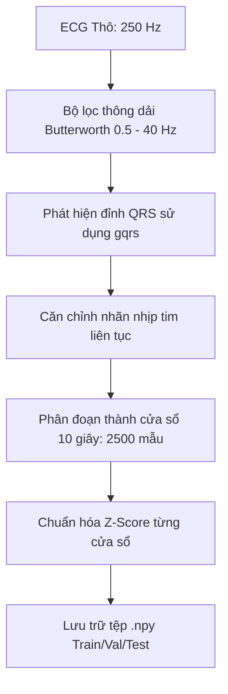

# Báo cáo Giai đoạn 1: Tiền xử lý dữ liệu ECG (ECG Preprocessing)

## 1. Mục tiêu
Chuẩn bị bộ dữ liệu sạch, chuẩn hóa và được chia tách đúng quy chuẩn khoa học từ cơ sở dữ liệu **MIT-BIH Atrial Fibrillation Database (AFDB)** của PhysioNet phục vụ việc huấn luyện mô hình học sâu nhận diện Rung nhĩ (AFIB).

---

## 2. Nguồn dữ liệu
* **Cơ sở dữ liệu:** MIT-BIH Atrial Fibrillation Database (AFDB).
* **Đặc điểm:** Bao gồm 25 bản ghi ECG sóng dài (khoảng 10 giờ mỗi bản ghi), ECG 2 kênh, tần số lấy mẫu gốc là 250 Hz. Bản ghi chứa các nhãn sự kiện nhịp tim liên tục (Normal rhythm, AFIB rhythm, v.v.).

---

## 3. Quy trình xử lý tín hiệu (Signal Processing Pipeline)

Mỗi bản ghi ECG được xử lý qua các bước tuần tự sau:

### 3.1. Bộ lọc thông dải (Bandpass Filtering)
*   **Thiết kế:** Bộ lọc Butterworth bậc 3 thông dải từ **0.5 Hz đến 40 Hz**.
*   **Mục đích:**
    *   Cắt tần số dưới 0.5 Hz để loại bỏ hiện tượng trôi đường đẳng điện (baseline wander) do bệnh nhân thở hoặc dịch chuyển điện cực.
    *   Cắt tần số trên 40 Hz để loại bỏ nhiễu cơ (muscle artifact) và nhiễu tần số công nghiệp (50/60 Hz powerline interference).
*   **Toán học:** Sử dụng biểu diễn bộ lọc Zero-phase (hàm `sosfilt` chạy tiến và lùi) để không làm lệch pha của các đỉnh sóng ECG.

### 3.2. Phát hiện đỉnh QRS và Căn chỉnh nhãn
*   Sử dụng giải thuật `gqrs` của thư viện `wfdb` để định vị vị trí các đỉnh QRS (nhịp tim).
*   **Căn chỉnh nhãn:** Do nhãn nhịp tim trong AFDB được đánh dấu ở khoảng thời gian bất kỳ, thuật toán sẽ căn chỉnh nhãn nhịp tim tương ứng cho từng nhịp QRS phát hiện được để loại bỏ sai số lệch pha thời gian.

### 3.3. Phân đoạn cửa sổ (Window Segmentation)
*   Tín hiệu ECG được chia thành các cửa sổ độ dài **10 giây** (tương đương $250 \text{ Hz} \times 10 \text{ s} = 2500 \text{ mẫu}$).
*   Sử dụng cơ chế cửa sổ trượt gối đầu (overlapping window) với bước nhảy $Stride = 500 \text{ mẫu}$ (2 giây) để tăng cường dữ liệu (data augmentation) cho tập huấn luyện.

### 3.4. Chuẩn hóa Z-Score
Mỗi cửa sổ 10 giây được chuẩn hóa độc lập để đảm bảo biên độ tín hiệu đồng nhất, tránh ảnh hưởng bởi sự thay đổi điện trở tiếp xúc da của từng bệnh nhân:

$$x_{\text{norm}} = \frac{x - \mu}{\sigma}$$

Trong đó:
*   $\mu$: Giá trị trung bình của cửa sổ 10 giây đó.
*   $\sigma$: Độ lệch chuẩn của cửa sổ 10 giây đó.

---

## 4. Phân chia dữ liệu (Dataset Splitting)

Để đảm bảo tính khách quan và khả năng tổng quát hóa của mô hình trên các bệnh nhân mới:
1.  **Tách biệt Bệnh nhân (Patient-wise separation):** Chọn ra 4 bệnh nhân hoàn toàn độc lập làm tập kiểm thử (Test Set): **04126, 05091, 08215, 08405**. Dữ liệu của các bệnh nhân này tuyệt đối không xuất hiện trong tập huấn luyện hoặc kiểm định.
2.  **Tập Train/Val:** Sử dụng dữ liệu của các bệnh nhân còn lại, chia ngẫu nhiên thành:
    *   **Tập huấn luyện (Train Set):** 250,734 mẫu (chiếm ~85% tập Train/Val).
    *   **Tập kiểm định (Validation Set):** 43,161 mẫu (chiếm ~15% tập Train/Val).
3.  **Tập kiểm thử (Test Set):**
    *   **Tập gộp (Overall Test Set):** 65,188 mẫu (dùng để đo hiệu năng chung).
    *   **Tập riêng lẻ (Patient-specific Test Set):** Lưu riêng biệt cho từng bệnh nhân trong số 4 bệnh nhân trên để đánh giá sự khác biệt cá thể.

Các tệp dữ liệu đầu ra được lưu trữ dưới dạng định dạng nhị phân `.npy` hiệu năng cao trong thư mục `database/processed/`.
