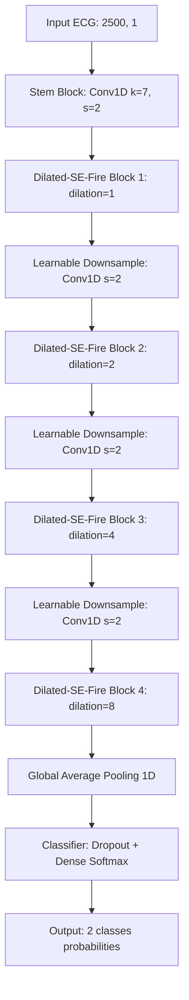
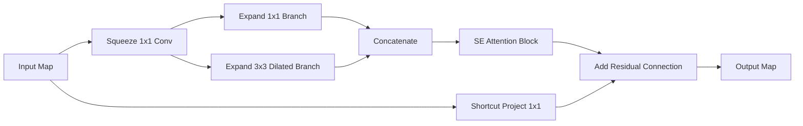

# Hướng dẫn Kỹ thuật: Xây dựng, Huấn luyện và Đánh giá mô hình Dilated-SE-FireNet (Float32)

Tài liệu này giải thích cặn kẽ nguyên lý hoạt động, kiến trúc toán học, cấu trúc mã nguồn trong thư mục [src/](file:///home/pd/data/info_model/build_model/src) và hướng dẫn chi tiết cách chạy huấn luyện từ đầu đến cuối một cách độc lập.

---

## 1. Nguyên lý Kiến trúc Dilated-SE-FireNet

Mô hình **Dilated-SE-FireNet** được thiết kế để giải quyết bài toán phát hiện Rung nhĩ (AFIB) từ tín hiệu điện tâm đồ (ECG) 1 kênh. Rung nhĩ có 2 đặc trưng quan trọng:
* **Tính chất cục bộ:** Mất sóng P, xuất hiện sóng f nhỏ hỗn loạn ở đường nền.
* **Tính chất toàn cục:** Khoảng cách giữa các nhịp tim (R-R interval) hoàn toàn không đều.

Để học được cả hai đặc trưng này một cách nhẹ nhất (phù hợp cho thiết bị nhúng), mô hình kết hợp các khối:



### 1.1. Stem Block (Khối Gốc)
* **Toán học:** Đầu vào $(2500, 1)$ đi qua một bộ lọc Conv1D có kích thước kernel lớn ($K=7$) và bước nhảy $Stride=2$.
* **Mục đích:** Kernel lớn giúp bao quát hình thái sóng ECG thô lúc đầu (nhận diện các sườn dốc QRS). $Stride=2$ giúp giảm độ phân giải thời gian ngay lập tức xuống còn một nửa ($1250$ mẫu), giúp tiết kiệm tài nguyên tính toán cho các tầng phía sau.

### 1.2. Khối Dilated-SE-Fire Module (Khối nhân)
Khối này cải tiến từ khối Fire Module của SqueezeNet kết hợp với giãn nở (dilation) và cơ chế chú ý (attention):



1. **Squeeze Layer (Tầng nén - 1x1 Conv):** Giảm số lượng kênh (channels) đi 4 lần (ví dụ từ 96 kênh xuống 24 kênh). Giúp giảm số lượng tham số tính toán của tầng expand tiếp theo.
2. **Expand Layer (Tầng mở rộng):** Chia làm 2 nhánh song song:
   * **Nhánh 1x1 Conv:** Học tổ hợp các đặc trưng theo chiều sâu kênh (cross-channel features).
   * **Nhánh 3x3 Conv Dilated:** Sử dụng tích chập giãn nở với hệ số dilation $d$. Tích chập giãn nở chừa các khoảng trống ở giữa các trọng số lọc, giúp **mở rộng trường nhìn thời gian** mà không làm tăng số lượng tham số.
3. **Concatenate:** Ghép đầu ra của 2 nhánh expand lại theo chiều sâu kênh.
4. **Squeeze-and-Excitation (SE) Block (Chú ý kênh):**
   * Học mức độ quan trọng của từng kênh đặc trưng.
   * **Squeeze:** Dùng Global Average Pooling để nén chiều thời gian về kích thước $(1, Channels)$.
   * **Excitation:** Đi qua 2 lớp Dense: Lớp đầu giảm số kênh đi $r=4$ lần (LeakyReLU kích hoạt), lớp sau khôi phục lại số kênh cũ (Sigmoid kích hoạt) để xuất ra bộ trọng số từ $0$ đến $1$ cho mỗi kênh.
   * **Scale:** Nhân bộ trọng số này trở lại ma trận đặc trưng ban đầu. Kênh nào chứa sóng f nhiễu sẽ bị ép về 0, kênh nào chứa nhịp tim sẽ được giữ nguyên.
5. **Residual Skip Connection (Kết nối tắt):**
   * Cộng trực tiếp đầu vào của block vào đầu ra của khối SE.
   * Nếu số lượng kênh đầu vào khác số lượng kênh đầu ra, đầu vào sẽ được đi qua một tầng **Conv1D 1x1 Projection** để khớp số kênh trước khi cộng.
   * Giúp gradient truyền thẳng qua các tầng mà không bị triệt tiêu (vanishing gradient), giúp mạng huấn luyện cực kỳ ổn định.

---

## 2. Chi tiết cấu trúc các File trong `src/`

### 2.1. [src/config.py](file:///home/pd/data/info_model/build_model/src/config.py) (Cấu hình)
Chứa toàn bộ các tham số của hệ thống. Bạn chỉ cần sửa file này nếu muốn thay đổi siêu tham số:
* `TARGET_FS` (250): Tần số lấy mẫu tín hiệu ECG.
* `WINDOW_SIZE` (2500): Độ dài cửa sổ 10 giây đầu vào.
* `FIRE_BLOCKS`: Định nghĩa số bộ lọc cho 4 block. Ví dụ: `("block1", 12, 24, 1, 48)` có nghĩa là: squeeze dùng 12 filters, hai nhánh expand dùng 24 filters (tổng kênh đầu ra = 24 + 24 = 48), dilation = 1.
* `EPOCHS` (60), `BATCH_SIZE` (256): Tham số huấn luyện.
* `LABEL_SMOOTHING` (0.1): Làm mượt nhãn nhị phân để chống overfitting (nhãn `0` thành `0.05`, nhãn `1` thành `0.95`).

### 2.2. [src/utils.py](file:///home/pd/data/info_model/build_model/src/utils.py) (Tiện ích)
* `set_seed()`: Khóa seed ngẫu nhiên (`42`) trên cả System, Numpy và TensorFlow để đảm bảo kết quả huấn luyện có thể lặp lại giống hệt nhau ở mọi lần chạy.
* `setup_gpu_memory_growth()`: Cấu hình TensorFlow chỉ chiếm dung lượng VRAM thực tế cần thiết thay vì khóa cứng 100% dung lượng GPU ngay khi khởi động.
* `load_processed_data()`: Tự động tìm và đọc dữ liệu đã chia sẵn từ các thư mục [database/processed/train/](file:///home/pd/data/info_model/build_model/database/processed/train) và [val/](file:///home/pd/data/info_model/build_model/database/processed/val).

### 2.3. [src/model.py](file:///home/pd/data/info_model/build_model/src/model.py) (Mô hình)
* Chứa toàn bộ các hàm xây dựng đồ thị Keras: `conv_bn_lrelu`, `se_block`, `dilated_fire_module`, `learnable_downsample`, và `build_dilated_se_firenet`.
* Tệp này có hàm `__main__` độc lập. Khi chạy trực tiếp `python -m src.model`, nó sẽ khởi tạo mô hình và in ra bảng cấu trúc tóm tắt (summary) cùng số lượng tham số.

### 2.4. [src/check_model.py](file:///home/pd/data/info_model/build_model/src/check_model.py) (Kiểm thử đồ thị)
* **Nguyên lý:** Chạy xác thực đồ thị trước khi huấn luyện thực tế.
* Nó tạo một mảng ngẫu nhiên (dummy data) có shape `(5, 2500, 1)`, đẩy qua mô hình và kiểm tra:
  1. Shape đầu ra phải đúng là `(5, 2)`.
  2. Tổng xác suất đầu ra của mỗi mẫu phải bằng `1.0` (xác thực Softmax hoạt động đúng).
  3. Không có giá trị `NaN` hoặc `Inf`.
  4. Đọc thử 8 mẫu dữ liệu thật từ ổ đĩa để kiểm tra độ tương thích kiểu dữ liệu (`float32`).

### 2.5. [src/train.py](file:///home/pd/data/info_model/build_model/src/train.py) (Huấn luyện chính thức)
* **tf.data Pipeline:** Sử dụng `tf.data.Dataset` để xây dựng luồng nạp dữ liệu bất đồng bộ.
* **Augmentation động:** Định nghĩa hàm `augment_ecg(x, y)`:
  ```python
  noise = tf.random.normal(tf.shape(x), mean=0.0, stddev=0.03, dtype=tf.float32)
  amp = tf.random.uniform([], minval=0.9, maxval=1.1, dtype=tf.float32)
  offset = tf.random.uniform([], minval=-0.05, maxval=0.05, dtype=tf.float32)
  x_aug = x * amp + noise + offset
  ```
  Hàm này tự động chạy trên CPU thông qua `.map()` của `tf.data` đối với tập Train. Điều này giữ đồ thị mô hình luôn sạch, sẵn sàng lượng tử hóa sang TFLite INT8 mà không bị lỗi tương thích phần cứng.
* **Learning Rate Cosine Decay:** LR bắt đầu ở mức `1e-3` và tự động giảm dần theo đường cong Cosine về `5e-5` ở bước huấn luyện cuối cùng.
* **Callbacks:**
  * `ModelCheckpoint`: Tự động theo dõi `val_loss`. Nếu epoch hiện tại có loss thấp hơn các epoch trước, nó sẽ lưu đè mô hình tốt nhất vào `outputs/checkpoints/best_dilated_se_firenet.keras`.
  * `EarlyStopping`: Theo dõi `val_loss`. Nếu liên tục trong 10 epoch (`patience=10`) mà loss không cải thiện, quá trình train sẽ tự động dừng để tránh Overfitting.
  * `CSVLogger`: Ghi lại nhật ký huấn luyện (loss, accuracy của tập train/val qua mỗi epoch) vào tệp CSV để vẽ đồ thị sau này.

### 2.6. [src/evaluate.py](file:///home/pd/data/info_model/build_model/src/evaluate.py) (Đánh giá chi tiết mô hình Float32)
* **Nguyên lý:** Đánh giá hiệu năng của mô hình sau huấn luyện trên tập dữ liệu kiểm thử độc lập (Test Set) chưa từng xuất hiện trong quá trình train/val.
* **Chức năng:**
  * **Đánh giá tổng thể (Overall):** Load tệp `best_dilated_se_firenet.keras`, dự đoán nhãn cho toàn bộ tập test gộp (`X_test.npy`, `y_test.npy`), tính toán Accuracy, Precision, Recall, F1-Score và sinh ra Ma trận nhầm lẫn tổng thể (`confusion_matrix_overall.png`), lưu báo cáo vào `evaluation_float32.json`.
  * **Đánh giá theo từng bệnh nhân (Patient-by-patient):** Đánh giá hiệu năng riêng lẻ trên 4 bệnh nhân độc lập (`04126`, `05091`, `08215`, `08405`) để kiểm chứng độ ổn định và tổng quát hóa của mô hình trên các cá thể khác nhau. Sinh ra ma trận nhầm lẫn riêng cho từng ca bệnh và lưu báo cáo vào `evaluation_float32_patients.json`.

---

## 3. Hướng dẫn vận hành chi tiết (Step-by-step Execution)

Để tự chạy lại toàn bộ Giai đoạn 2 mà không cần trợ giúp, bạn thực hiện theo các bước sau trong terminal:

### Bước 3.1: Kích hoạt môi trường ảo (Virtual Environment)
Mở terminal tại thư mục gốc của project `/home/pd/data/info_model/build_model` và chạy lệnh:

```bash
# Kích hoạt môi trường ảo
source .venv/bin/activate
```

> [!NOTE]
> Khi môi trường ảo được kích hoạt thành công, bạn sẽ nhìn thấy ký tự `(.venv)` ở đầu dòng lệnh của terminal.

### Bước 3.2: Kiểm tra đồ thị mô hình
Để đảm bảo toàn bộ kiến trúc mô hình đã liên kết chính xác và tương thích hoàn toàn với dữ liệu thực tế, chạy lệnh:

```bash
python -m src.check_model
```

**Kết quả mong đợi:**
* Bảng tóm tắt mô hình in ra chi tiết.
* Tổng tham số hiển thị: `Total params: 110,694`.
* Nhận được thông báo thành công ở cuối:
  ```text
  ==================================================
  [SUCCESS] MODEL STRUCTURE VERIFICATION PASSED!
  ==================================================
  ```

### Bước 3.3: Tiến hành huấn luyện mô hình
Chạy lệnh huấn luyện chính thức với cấu hình mặc định (60 epochs, batch size 256):

```bash
python -m src.train
```

Nếu bạn muốn tùy chỉnh các thông số trực tiếp từ dòng lệnh mà không muốn sửa file `config.py`, bạn có thể truyền các tham số (arguments) sau:
* `--epochs`: Số lượng epochs huấn luyện (ví dụ: `--epochs 60`).
* `--batch_size`: Kích thước batch dữ liệu (ví dụ: `--batch_size 128` nếu GPU bị tràn bộ nhớ).
* `--lr`: Tốc độ học ban đầu (ví dụ: `--lr 0.0005`).

**Ví dụ chạy tùy chỉnh:**
```bash
python -m src.train --epochs 40 --batch_size 128 --lr 0.001
```

**Cách giám sát quá trình huấn luyện:**
* Trong lúc train chạy, màn hình sẽ hiển thị tiến trình của từng epoch kèm theo các chỉ số:
  * `loss` và `accuracy`: Chỉ số trên tập huấn luyện (có áp dụng augmentation).
  * `val_loss` và `val_accuracy`: Chỉ số trên tập đánh giá (không áp dụng augmentation).
  * `precision` và `recall` (đặc biệt theo dõi `val_recall` của lớp AFIB).
* Bạn có thể mở tệp [outputs/reports/train_log.csv](file:///home/pd/data/info_model/build_model/outputs/reports/train_log.csv) để theo dõi các chỉ số huấn luyện đã lưu qua các epoch.

### Bước 3.4: Đánh giá chi tiết mô hình Float32
Sau khi đã huấn luyện xong và có tệp mô hình `best_dilated_se_firenet.keras` trong thư mục checkpoints, hãy tiến hành đánh giá chi tiết trên tập kiểm thử bằng cách chạy lệnh:

```bash
python -m src.evaluate
```

Các tham số dòng lệnh tùy chọn hỗ trợ:
* `--data_dir`: Thư mục dữ liệu kiểm thử (mặc định: `database/processed`).
* `--model_path`: Đường dẫn tệp mô hình Keras (mặc định: `outputs/checkpoints/best_dilated_se_firenet.keras`).
* `--report_dir`: Thư mục lưu trữ báo cáo đánh giá (mặc định: `outputs/reports`).

**Kết quả mong đợi:**
* Độ chính xác tổng thể (Accuracy) và các chỉ số Precision, Recall lớp AFIB hiển thị trực quan trên terminal.
* Năm tệp ma trận nhầm lẫn dạng PNG (`confusion_matrix_overall.png`, `confusion_matrix_04126.png`, v.v.) được lưu thành công vào `outputs/reports/`.
* Báo cáo đánh giá tổng thể và chi tiết từng bệnh nhân được lưu lần lượt vào `evaluation_float32.json` và `evaluation_float32_patients.json`.
